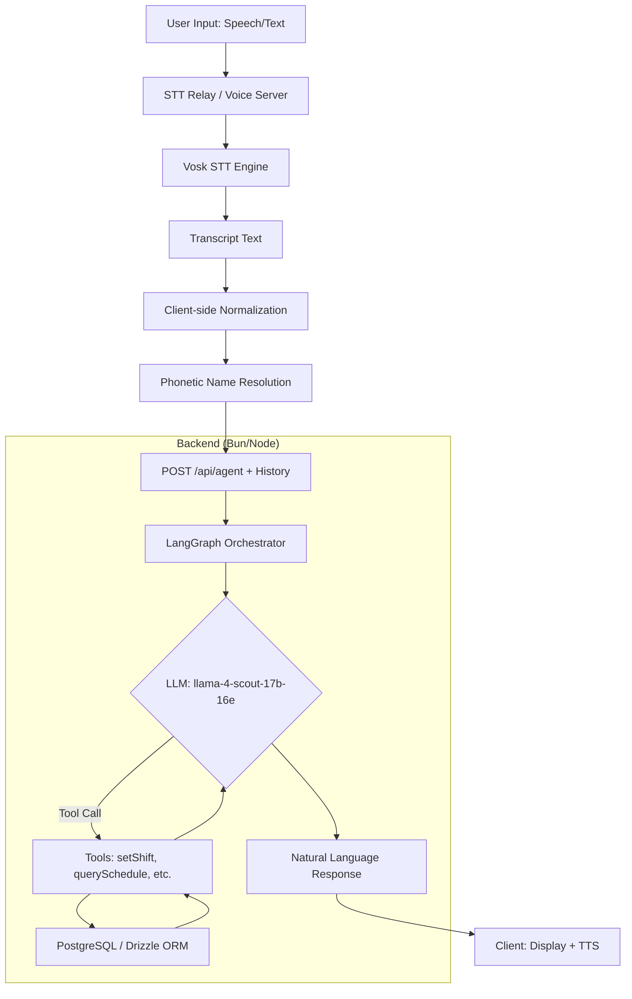

# Voice & AI Assistant — Technical Implementation & Workflow

## Overview

The AI Duty Roster Assistant is a context-aware system designed for hands-free nurse scheduling. It uses a LangGraph-orchestrated agent that processes natural language (speech-to-text via Vosk or direct text chat) to query and update a PostgreSQL-backed roster. Key features include phonetic name resolution (English → Bengali), conversation memory, and automated tool execution.

## System Architecture

## Core Workflow

### 1. Pre-processing (Client-side)
- **Normalization (`normalizeText`)**: Corrects common STT misinterpretations (e.g., "schiff" → "shift", "kinnear" → "can you") using a predefined correction map.
- **Phonetic Resolution (`resolveNamesInText`)**: Scans the normalized text for English phonetic equivalents of nurse names and replaces them with their Bengali script versions (e.g., "joy three" → "জয়শ্রী"). This ensures the LLM receives the exact keys used in the database.

### 2. Contextual Agent Loop (`packages/agent`)
The agent is built using **LangGraph** with a custom state machine:
- **Extreme Brevity**: The system prompt enforces a "1 sentence max" rule with zero conversational filler.
- **Intent Prioritization**: Explicit rules force the agent to use query tools for "who/what/which" requests to avoid misinterpreting them as update commands.
- **State Persistence**: The client passes the full conversation history (`history` array) in every request. This allows the agent to resolve pronouns ("it", "her") and relative references ("on the 31st").
...
### 4. Technical Improvements
- **12-Hour Time Formatting**: The `ai-parser` package provides `formatTime12h()`, ensuring all schedule queries return human-readable times (e.g., "10:00 PM").
- **TTS Translation Layer**: To handle Bengali script names, the `ai-parser` provides `resolveBengaliToEnglish()`. The client-side logic uses this to translate Bengali names in agent responses to English phonetic equivalents before passing them to the Web Speech API. This ensures names like "জয়শ্রী" are correctly pronounced as "Joysree".
- **Pronoun Resolution**: By mapping message roles to "human" and "assistant" explicitly in the backend, the LangGraph memory buffer correctly attributes context, enabling commands like "Update **it** to night".
- **Voice Reliability**: Fixed browser garbage collection issues by maintaining a persistent reference to the `SpeechSynthesisUtterance` object, preventing the audio from cutting off mid-sentence.
- **Direct Database Interaction**: Agent tools use `@Duty-Roster/db` directly, bypassing the tRPC layer used by the web UI for lower latency and atomic tool execution.

## Data Flow: Update Scenario

1. **User**: "When is Joyoshree on 31?"
   - **Transcript**: "When is Joyoshree on 31?"
   - **Resolved**: "When is জয়শ্রী on 31?"
   - **Agent Call**: `querySchedule(nurseName: "জয়শ্রী", dateKey: "2026-05-31")`
   - **Response**: "জয়শ্রী is on morning shift (08:00 AM-02:00 PM) on 2026-05-31."
2. **User**: "Update it to night."
   - **Context**: The agent identifies "it" refers to the shift on "2026-05-31" and the nurse "জয়শ্রী".
   - **Agent Call**: `setShift(nurseName: "জয়শ্রী", shiftName: "night", dateKey: "2026-05-31")`
   - **Response**: "Updated: জয়শ্রী is now assigned to night on 2026-05-31."

## Key Technical Components

- **Runtime**: Bun (apps/server, apps/ai-server).
- **Orchestration**: LangGraph (StateGraph, MessagesAnnotation).
- **ORM**: Drizzle ORM with PostgreSQL.
- **STT**: Vosk (Python) + WebSocket Relay.
- **UI**: Next.js + React Query + tRPC (for non-AI features).

## Configuration

- `GROQ_API_KEY`: Primary LLM provider.
- `OPENO_ROUTER_API_KEY`: Fallback provider.
- `STT_WS_URL`: WebSocket endpoint for the STT engine.
- `AI_PORT`: Port for the AI server relay (default: 3002).
