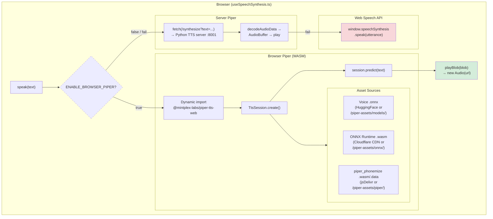
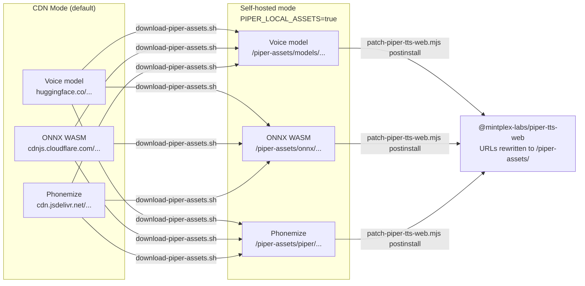

# Voice Assistant — Setup PRD

## Vosk STT + WebSocket · Turborepo Monorepo

**Scope**: Get Vosk running, WebSocket plumbed end-to-end, transcript confirmed in browser
**Next doc**: name mapper + shift parser + NeonDB update

**Status**: Part 1 ✅ Complete | Part 2 ✅ Complete | Part 3 ✅ Complete | Part 4 ✅ Complete | Part 5 ✅ Complete | Part 6 ✅ Complete | TTS (Piper) ✅ Complete

---

## The Cloudflare Workers Constraint

Your `apps/server` runs on the Cloudflare Workers adapter — which means:

- No `createBunWebSocket` (that's Bun runtime only)
- No persistent TCP/WebSocket server in the Workers process
- Workers _do_ support WebSockets via the **Durable Objects** API, but that's
  significant complexity for a pet feature

**Simplest solution**: run the voice WebSocket as a **separate lightweight Bun process**
(`apps/voice-server`) that lives alongside your Workers server locally and deploys
independently (or stays local-only). Your existing `apps/server` is not touched at all.

```
duty-roster/
├── apps/
│   ├── web/              ← Next.js (port 3001)
│   ├── server/           ← Cloudflare Workers + Hono + tRPC + Better Auth (port 3000, unchanged)
│   ├── voice-server/     ← ✅ IMPLEMENTED — Bun + Hono WebSocket (voice relay, port 3002)
│   └── tts/              ← ✅ IMPLEMENTED — FastAPI Piper TTS server (port 8001)
├── packages/
│   ├── api/
│   ├── auth/
│   ├── config/
│   ├── db/
│   ├── env/
│   └── ui/
└── stt/                  ← ✅ IMPLEMENTED — Vosk streaming WebSocket server (port 5001)
```

---

## Architecture (Data Flow)

```
Browser mic ──Float32──> AudioWorklet ──Int16 PCM──> useVoice hook
                                                          │
                                                     WebSocket
                                                          │
                                                          ▼
                                              apps/voice-server (port 3002)
                                              Bun + Hono, WS relay
                                                          │
                                                     WebSocket
                                                          │
                                                          ▼
                                              stt/server.py (port 5001)
                                              Python + Vosk, streaming WS
                                                          │
                                                          ▼
                                          Voice transcript returned to browser
                                                          │
                                                          ▼
                                              useVoiceAssistantLogic
                                              (parse command, accumulate data)
                                                          │
                                    ┌─────────────────────┼─────────────────────┐
                                    ▼                     ▼                     ▼
                          Missing fields?          Confirmation needed     Full command?
                          (ask user)              (yes/no)                 (execute)
                                    │                     │                     │
                                    ▼                     ▼                     ▼
                              TTS question         TTS confirmation        tRPC mutation
                              + message            + message                (shift.update)
```

**Why two WebSocket hops?** The voice-server is a thin relay. It connects the browser WS
to the STT WS so the browser never needs to know about the Python process. This also lets
us swap STT backends later without changing frontend code.

---

## TTS (Text-to-Speech) — Piper Browser WASM ✅ IMPLEMENTED

Text-to-speech via [Piper](https://github.com/rhasspy/piper) running entirely in the browser over WebAssembly, with a server-side fallback and native Web Speech API as the last resort.

### Overview

```
┌─────────────────────────────────────────────────────────────────────┐
│                     useSpeechSynthesis.ts                            │
│                                                                     │
│  speak("hello")                                                     │
│       │                                                             │
│       ├──► Browser Piper (WASM) ──── success? ──► play Blob         │
│       │        │ fail                                               │
│       │        ▼                                                    │
│       ├──► Server Piper (Python) ─── success? ──► play AudioBuffer  │
│       │        │ fail                                               │
│       │        ▼                                                    │
│       └──► Web Speech API ────────── always works ──► utterance     │
└─────────────────────────────────────────────────────────────────────┘
```

### Architecture Diagram



### Core Components

| Component | Role | Source |
|-----------|------|--------|
| `@mintplex-labs/piper-tts-web` | JS orchestration — text in, WAV Blob out | npm |
| `onnxruntime-web` | Neural net inference engine (WASM) | npm |
| `@diffusionstudio/piper-wasm` | Phonemize library (text → phoneme IDs) | jsDelivr CDN |
| Voice model `.onnx` | Pre-trained TTS voice (e.g. `en_US-hfc_female-medium`) | HuggingFace |

### Data Flow

```
Text input
    │
    ▼
┌─────────────────────────────────────────────────────┐
│ Piper TTS Pipeline (@mintplex-labs/piper-tts-web)   │
│                                                     │
│  Text ──► piper_phonemize (WASM) ──► phoneme IDs   │
│              ↑                                      │
│         piper_phonemize.wasm + .data                │
│                                                     │
│  Phoneme IDs ──► onnxruntime-web (WASM) ──► PCM    │
│                     ↑                               │
│               *.wasm (ort-wasm-simd, etc.)          │
│                                                     │
│  PCM ──► WAV Blob (RIFF header + PCM data)          │
└─────────────────────────────────────────────────────┘
                    │
                    ▼
          new Audio(blobUrl) → play()
```

### Fallback Chain

Defined in `apps/web/src/features/voice-assistant/hooks/useSpeechSynthesis.ts`:

| Priority | Method | Env flag | Latency | Dependency |
|----------|--------|----------|---------|------------|
| 1st | Browser Piper (WASM) | `NEXT_PUBLIC_BROWSER_PIPER=true` | ~500-1000ms | WASM-capable browser |
| 2nd | Server Piper (Python) | `NEXT_PUBLIC_TTS_URL` | ~200-500ms + network | Python TTS server on :8001 |
| 3rd | Web Speech API | always enabled | instant | Browser native |

### Client Integration (useSpeechSynthesis.ts)

1. **Browser Piper** (primary) — `@mintplex-labs/piper-tts-web` loaded via dynamic import
   - Singleton `TtsSession` created on first use
   - `session.predict(text)` returns a WAV `Blob`
   - Played via `new Audio(URL.createObjectURL(blob))`

2. **Server Piper** (fallback 1) — Python Piper server at `NEXT_PUBLIC_TTS_URL` (default `http://localhost:8001`)
   - Fetches WAV via `GET /synthesize?text=...`
   - Decodes with `AudioContext.decodeAudioData()`

3. **Web Speech API** (fallback 2) — `window.speechSynthesis.speak(utterance)`

### Asset Management

#### Self-hosted assets (`PIPER_LOCAL_ASSETS=true`)

```
public/piper-assets/
├── models/en/en_US/hfc_female/medium/
│   ├── en_US-hfc_female-medium.onnx          ← from HuggingFace
│   └── en_US-hfc_female-medium.onnx.json     ← voice config
├── onnx/
│   ├── ort-wasm-simd.wasm                    ← from node_modules/onnxruntime-web
│   ├── ort-wasm-simd-threaded.wasm
│   ├── ort-wasm-simd.jsep.mjs
│   ├── ort-wasm-simd-threaded.jsep.mjs
│   ├── ort-wasm-simd.asyncify.mjs
│   └── ort-wasm-simd-threaded.asyncify.mjs
└── piper/
    ├── piper_phonemize.data                   ← from jsDelivr CDN
    ├── piper_phonemize.js
    └── piper_phonemize.wasm
```

#### Asset resolution



#### Scripts

| Script | Purpose |
|--------|---------|
| `apps/web/scripts/download-piper-assets.sh` | Downloads all assets (model, ONNX WASM, phonemize WASM) to `public/piper-assets/` |
| `apps/web/scripts/patch-piper-tts-web.mjs` | Postinstall — rewrites npm package URLs from CDN → local `/piper-assets/` |
| `apps/web/scripts/patch-next-on-pages-build.mjs` | Aliases `onnxruntime-web` etc. to `false` in Next.js config for Pages build |

### Configuration

#### Environment variables

| Variable | Default | Description |
|----------|---------|-------------|
| `NEXT_PUBLIC_BROWSER_PIPER` | `false` | Enable browser-side Piper WASM TTS |
| `NEXT_PUBLIC_PIPER_LOCAL_ASSETS` | `false` | Serve assets from `/piper-assets/` instead of CDN |
| `NEXT_PUBLIC_TTS_URL` | `http://localhost:8001` | Python TTS server URL (fallback) |

#### Next.js bundling

In `next.config.ts`, the three packages are aliased to `false` to prevent Next.js from attempting to bundle them at build time (they are WASM modules loaded dynamically at runtime):

```ts
config.resolve.alias["onnxruntime-web"] = false;
config.resolve.alias["@mintplex-labs/piper-tts-web"] = false;
config.resolve.alias["@diffusionstudio/piper-wasm"] = false;
```

### Echo Protection

In `VoiceTrigger.tsx`, a `transcriptSkippedWhileSpeakingRef` flag discards:

- Any transcript that arrives while `isSpeakingRef.current` is `true`
- The first transcript after `isSpeakingRef` becomes `false` (residual echo from STT hearing TTS output through speakers)

Plus a 1.5s cooldown after speech ends before processing new transcripts.

### Performance

| Metric | Value |
|--------|-------|
| Model size | ~63 MB (downloaded once, cached in OPFS) |
| WASM size | ~155 KB total |
| First-load latency | 5-15 s (download + cache) |
| Subsequent latency | instant (OPFS cache) |
| Inference time | ~500-1000 ms per utterance |
| Model memory | ~100 MB in browser tab |
| Sample rate | 22050 Hz (Piper native) |
| Browser support | Chrome, Firefox, Safari, Edge |

### Server Piper (fallback)

The Python TTS server (`apps/tts/`) provides the same voice model via HTTP:

```
GET /synthesize?text=hello
→ 200 audio/wav (PCM 22050Hz mono)
```

Used when browser WASM is unavailable or fails.

---

## Part 1 — Vosk STT Server ✅ COMPLETE

Streaming WebSocket server. Accepts raw PCM16 chunks (any size), feeds them to Vosk
incrementally, and streams back partial + final transcriptions in real time.

### 1.1 Install ✅ DONE

**Python dependencies:**

```bash
pip install -r stt/requirements.txt
```

`stt/requirements.txt`:

```
vosk==0.3.44
websockets>=13.0
```

**Vosk model** (not committed — ~68MB, downloaded via script):

```bash
bash scripts/setup-stt.sh
```

This downloads `vosk-model-small-en-us-0.15` (~40MB zip) and extracts it to
`stt/models/`. The STT server expects it at `stt/models/vosk-model-small-en-us-0.15/`. Model files are gitignored — see `scripts/setup-stt.sh` for the full download logic.

### 1.2 `stt/server.py` ✅ IMPLEMENTED

```python
#!/usr/bin/env python3
"""
Streaming STT server — accepts raw PCM16 chunks over WebSocket,
feeds them to Vosk incrementally, and streams back partial + final results.

WebSocket message protocol:
  → binary (raw PCM16 16kHz mono, any chunk size)
  ← {"type":"partial","text":"..."}
  ← {"type":"result","text":"...","confidence":0.95,"words":[...]}
  ← {"type":"error","message":"..."}
"""

import asyncio
import json
import struct

import websockets
from vosk import Model, KaldiRecognizer

MODEL_PATH = "stt/models/vosk-model-small-en-us-0.15"
SAMPLE_RATE = 16000

model = Model(MODEL_PATH)


async def handle(ws):
    rec = KaldiRecognizer(model, SAMPLE_RATE)
    rec.SetWords(True)

    async for message in ws:
        if isinstance(message, str):
            await ws.send(json.dumps({
                "type": "error",
                "message": "expected binary audio data",
            }))
            continue

        if rec.AcceptWaveform(message):
            result = json.loads(rec.Result())
            text = result.get("text", "")
            words = result.get("result", [])
            confidence = (
                sum(w.get("conf", 0) for w in words) / len(words)
                if words else 0.0
            )
            if text:
                await ws.send(json.dumps({
                    "type": "result",
                    "text": text,
                    "confidence": round(confidence, 2),
                    "words": words,
                }))
        else:
            partial = json.loads(rec.PartialResult())
            partial_text = partial.get("partial", "")
            if partial_text:
                await ws.send(json.dumps({
                    "type": "partial",
                    "text": partial_text,
                }))

    final = json.loads(rec.FinalResult())
    text = final.get("text", "")
    if text:
        words = final.get("result", [])
        confidence = (
            sum(w.get("conf", 0) for w in words) / len(words)
            if words else 0.0
        )
        await ws.send(json.dumps({
            "type": "result",
            "text": text,
            "confidence": round(confidence, 2),
            "words": words,
        }))


async def main():
    async with websockets.serve(handle, "localhost", 5001):
        print("STT streaming WS ready → ws://localhost:5001")
        await asyncio.Future()


if __name__ == "__main__":
    asyncio.run(main())
```

### 1.3 Confirm it works ✅ VERIFIED

```bash
python stt/server.py
# → STT streaming WS ready → ws://localhost:5001
```

---

## Part 2 — Voice Server (`apps/voice-server`) ✅ COMPLETE

Standalone Bun + Hono app. Owns the WebSocket connection from the browser
and relays audio to Vosk via a second WebSocket. Completely separate from
your Cloudflare Workers server. Includes an STT reconnection mechanism so
the browser can restart the STT connection without reconnecting.

### 2.1 Scaffold ✅ DONE

```bash
mkdir -p apps/voice-server/src
```

`apps/voice-server/package.json`: ✅ IMPLEMENTED

```json
{
  "name": "stt-server",
  "private": true,
  "module": "./src/index.ts",
  "scripts": {
    "dev": "bun run --watch src/index.ts",
    "start": "bun run src/index.ts"
  },
  "dependencies": {
    "hono": "^4.0.0"
  }
}
```

### 2.2 `apps/voice-server/src/index.ts` ✅ IMPLEMENTED

```ts
import { Hono } from "hono";
import { createBunWebSocket } from "hono/bun";
import { cors } from "hono/cors";

const { upgradeWebSocket, websocket } = createBunWebSocket();

const app = new Hono();

app.use(
  "*",
  cors({
    origin: [
      "http://localhost:3001", // Next.js dev (port 3001)
      process.env.WEB_ORIGIN ?? "", // production web URL
    ].filter(Boolean),
  }),
);

app.get("/health", (c) => c.json({ status: "ok" }));

const STT_WS_URL = process.env.STT_WS_URL ?? "ws://localhost:5001";

app.get(
  "/voice/stream",
  upgradeWebSocket(() => {
    let sttSocket: WebSocket | null = null;

    const connectSTT = () => {
      if (sttSocket) {
        sttSocket.close();
        sttSocket = null;
      }

      try {
        sttSocket = new WebSocket(STT_WS_URL);
        // @ts-expect-error Bun WebSocket accepts "buffer" binaryType
        sttSocket.binaryType = "buffer";
      } catch {
        // will be handled by connectSTT callers
      }
    };

    return {
      onOpen: (_e, ws) => {
        ws.send(JSON.stringify({ type: "connected" }));
        connectSTT();

        sttSocket!.onopen = () => {
          ws.send(JSON.stringify({ type: "stt_ready" }));
        };

        sttSocket!.onmessage = (event) => {
          ws.send(event.data as string);
        };

        sttSocket!.onclose = () => {
          ws.send(JSON.stringify({ type: "stt_disconnected" }));
          sttSocket = null;
        };

        sttSocket!.onerror = () => {
          ws.send(
            JSON.stringify({ type: "error", message: "STT connection failed" }),
          );
        };
      },

      onMessage: (evt, ws) => {
        const data = evt.data;

        if (typeof data === "string") {
          try {
            const cmd = JSON.parse(data);
            if (cmd.type === "restart") {
              connectSTT();
            }
          } catch {
            ws.send(
              JSON.stringify({
                type: "error",
                message: "Invalid text message",
              }),
            );
          }
          return;
        }

        // Binary audio chunk — forward to STT
        if (sttSocket && sttSocket.readyState === WebSocket.OPEN) {
          sttSocket.send(data as ArrayBuffer);
        }
      },

      onClose: () => {
        if (sttSocket) {
          sttSocket.close();
          sttSocket = null;
        }
      },
    };
  }),
);

const PORT = parseInt(process.env.VOICE_PORT ?? "3002");
console.log(`Voice server ready → ws://localhost:${PORT}`);

export default { fetch: app.fetch, websocket, port: PORT };
```

**Key design decisions:**

- **WebSocket relay, not HTTP proxy**: Audio is forwarded as binary WS messages instead of base64-encoded HTTP POST bodies. This reduces overhead and enables streaming partial results back to the browser.
- **STT connection lifecycle**: A dedicated WebSocket to Vosk is opened per browser connection and closed when the browser disconnects.
- **`restart` command**: The browser can send `{"type":"restart"}` to reset the STT connection without re-establishing its own WebSocket.

---

## Part 3 — Root Dev Scripts ✅ COMPLETE

The monorepo uses **Turbo** for orchestration. The root `package.json` scripts
manage all services:

```json
{
  "scripts": {
    "dev": "turbo dev",
    "dev:stt": ".venv/bin/python stt/server.py",
    "dev:tts": ".venv/bin/python apps/tts/app.py",
    "dev:voice": "turbo -F stt-server dev",
    "dev:web": "turbo -F web dev",
    "dev:server": "turbo -F server dev",
    "dev:setup:tts": ".venv/bin/pip install -r apps/tts/requirements.txt",
    "dev:setup:stt": ".venv/bin/pip install -r stt/requirements.txt",
    "dev:all": "trap 'kill 0' EXIT; bun run dev:stt & bun run dev:tts & bun run dev:voice & bun run dev:server & bun run dev:web & wait"
  }
}
```

### One-time setup

```bash
# Install Python dependencies (venv)
.venv/bin/pip install -r apps/tts/requirements.txt
.venv/bin/pip install -r stt/requirements.txt

# Download the Vosk ML model (only needed once per clone)
bash scripts/setup-stt.sh

# Download the Piper TTS voice model (only needed once per clone)
.venv/bin/python -m piper.download_voices --download-dir apps/tts/voices en_US-hfc_female-medium
```

### Running all services locally

Option A — Single terminal (all services in one process group):

```bash
bun run dev:all
```

Option B — Individual terminals:

```bash
# Terminal 1 — STT (Python/Vosk)
bun dev:stt
# → STT streaming WS ready → ws://localhost:5001

# Terminal 2 — TTS (Python/Piper)
bun dev:tts
# → INFO:     Uvicorn running on http://0.0.0.0:8001

# Terminal 3 — Voice relay (Bun/Hono)
bun dev:voice
# → Voice server ready → ws://localhost:3002

# Terminal 4 — Server (Cloudflare Workers / Hono)
bun dev:server
# → Server ready on port 3000

# Terminal 5 — Web (Next.js)
bun dev:web
# → http://localhost:3001
```

### Port assignments

| Service                       | Port | Runtime | Start command    | Status     |
| ----------------------------- | ---- | ------- | ---------------- | ---------- |
| Next.js                       | 3001 | Bun     | `bun dev:web`    | ✅ Running |
| Cloudflare Workers (wrangler) | 3000 | Workerd | `bun dev:server` | ✅ Running |
| Voice server                  | 3002 | Bun     | `bun dev:voice`  | ✅ Running |
| Vosk STT                      | 5001 | Python  | `bun dev:stt`    | ✅ Running |
| Piper TTS                     | 8001 | Python  | `bun dev:tts`    | ✅ Running |

---

## Part 4 — Next.js Frontend ✅ COMPLETE

### 4.1 `apps/web/public/pcm-processor.js` ✅ IMPLEMENTED

Runs in the browser audio thread. Converts Float32 mic samples → Int16 PCM.
Vosk requires Int16 at exactly 16kHz — without this, transcription returns empty string.

```js
class PCMProcessor extends AudioWorkletProcessor {
  process(inputs) {
    const input = inputs[0][0];
    if (!input) return true;

    const int16 = new Int16Array(input.length);
    for (let i = 0; i < input.length; i++) {
      int16[i] = Math.max(-32768, Math.min(32767, input[i] * 32768));
    }

    this.port.postMessage(int16.buffer, [int16.buffer]);
    return true;
  }
}

registerProcessor("pcm-processor", PCMProcessor);
```

### 4.2 `apps/web/src/features/voice-assistant/hooks/useVoice.ts` ✅ IMPLEMENTED

Fully implemented hook with:

- AudioContext at 16kHz with mono channel
- PCMProcessor AudioWorklet integration
- WebSocket connection to voice-server at `ws://localhost:3002/voice/stream`
- Binary PCM forwarding from worklet to WS
- `"partial"`, `"result"`, `"stt_ready"`, `"stt_disconnected"` message handling
- Auto-reconnection via `{"type":"restart"}` on STT disconnect
- Silence detection: 6s initial timeout, 3s after partial, 30s after final result
- Real-time audio levels (frequency data visualization)
- TTS via Piper with "Hey, how can I help?" greeting on start
- Proper resource cleanup on stop/unmount

Returns: `{ transcript, partial, isListening, ready, confidence, levels, start, stop }`

### 4.3 `apps/web/.env.local` ✅ IMPLEMENTED

```env
NEXT_PUBLIC_VOICE_WS_URL=ws://localhost:3002/voice/stream
```

### 4.4 `apps/web/src/features/voice-assistant/components/VoiceTrigger.tsx` ✅ IMPLEMENTED

Floating microphone button with:

- Toggles listening on click (shows Bot icon when closed, mic controls when open)
- WaveAnimation visualization during recording
- Chat UI showing parsed commands (recognized vs unrecognized)
- Text input fallback for manual entry
- Extracted `MessageItem` component for message rendering
- Extracted `WaveAnimation` component for audio visualization

### 4.5 Modular Components ✅ IMPLEMENTED

**`MessageItem.tsx`** — Extracted component for rendering voice messages:

- Displays "Extracted" for recognized commands, "Unrecognized" otherwise
- Shows extracted fields: action, nurse name, shift, date
- Toggle button to show/hide raw transcript

**`utils/commandParser.ts`** — Extracted command parsing logic:

- `parseCommand(text)` - parses voice input for shift, date, nurse name, action
- Uses `packages/voice-parser` for name matching and date parsing
- `SHIFT_WORDS` constant: ["morning", "evening", "night", "off"]
- `SKIP_WORDS` constant: common words to filter out

---

## Part 5 — Verify End-to-End ✅ COMPLETE

All verification steps passed:

```
[✅] python stt/server.py starts cleanly                  → ws://localhost:5001
[✅] health check: connect via WebSocket client, send empty → no crash

[✅] bun dev:voice starts on port 3002                     → ws://localhost:3002
[✅] curl http://localhost:3002/health                     → {"status":"ok"}

[✅] bun dev:web — Next.js running on port 3001
[✅] Click voice trigger → browser asks for mic permission
[✅] Speak command → transcript appears in UI
[✅] Partial results stream in real time
[✅] TTS greeting plays on start
[✅] Auto-stop after 2 seconds of silence
[✅] Command parsing extracts: nurse name, shift, date
```

### Additional Features Implemented

- **Text input fallback** — Type commands instead of speaking
- **Speech synthesis** — "Hey, how can I help?" greeting via Piper TTS (fallback: Web Speech API)
- **Audio visualization** — Real-time frequency bars during recording
- **Toggle raw transcript** — Show/hide original voice input
- **Modular architecture** — Separation of concerns with extracted components
- **English name display** — Bengali nurse names mapped to English aliases (e.g., জয়শ্রী → Joysree) for spoken responses
- **Echo protection** — Stale transcripts from TTS speaker echo are discarded before processing
- **Auto-close on confirm** — Mic stops, says "Done", then closes the assistant popover

---

## Part 6 — Command Parsing & Action ✅ COMPLETE

### Architecture Overview

The confirmation flow is implemented with a multi-state conversation system:

```
User Input → parseCommand() → Check if all required fields present
                                              │
                    ┌─────────────────────────┼─────────────────────────┐
                    ▼                         ▼                         ▼
              Missing fields?          Has all fields          Confirmation pending
              Ask user via TTS         Ask for confirmation    (yes/no response)
              + message               via TTS + message      │
                    │                         │                  │
                    ▼                         ▼                  ▼
              setAwaitingResponse         setPendingConfirmation    confirmShiftUpdate()
              true                        (nurse, shift, date)     or cancel
```

### 6.1 `useVoiceAssistantLogic.ts` ✅ IMPLEMENTED

Central hook managing the conversation flow:

- **Accumulated data**: Stores partial data (nurse, shift, date, englishName) across multiple utterances
- **Missing field detection**: Identifies which fields (nurse, shift, date) are missing
- **Confirmation flow**: Asks user to confirm yes/no after parsing a complete command
- **TTS integration**: Speaks questions and confirmations via Piper TTS with Bengali→English name mapping
- **Message management**: Maintains conversation history

Key functions:

- `askForMissingFields()` — Asks user for missing info (e.g., "Which nurse?")
- `askForConfirmation()` — Asks user to confirm the parsed command
- `processMessage()` — Main handler that routes incoming text through the flow

### 6.2 `useConfirmShiftUpdate.ts` ✅ IMPLEMENTED

Handles executing the shift update via tRPC:

- Queries roster for the given date to find matching nurse
- Converts date string to dateKey format (e.g., "May 12" → "2026-05-12")
- Maps shift name to shiftId (e.g., "morning" → "shift_morning")
- Calls `updateShift` mutation from `useUpdateShift` hook
- Handles "off" shift by setting shiftId to null

### 6.3 `useVoiceAssistantState.ts` ✅ IMPLEMENTED

State management hook providing:

- `pendingConfirmation` — Current confirmation state
- `messages` — Conversation history (array of ParsedMessage)
- `awaitingResponse` — Whether waiting for user input
- `lastAction` — Track confirmed/cancelled actions

### 6.4 `useSpeechSynthesis.ts` ✅ IMPLEMENTED

TTS hook with Piper engine + Web Speech API fallback:

- `speak(text)` — Speak the given text via Piper TTS (falls back to Web Speech API)
- `isSpeakingRef` — Ref for checking if currently speaking (used to guard echo transcripts)
- **Echo protection**: 1.5s cooldown after speech ends before processing new transcripts
- **Silence timeout**: 30s after final result to give user time to respond to assistant

### 6.5 New Components ✅ IMPLEMENTED

**`MessageList.tsx`** — Scrollable message container with auto-scroll

**`VoiceHeader.tsx`** — Header for voice popover with close button and status

**`VoiceInput.tsx`** — Text input + mic button + send button for manual entry

**`VoicePopover.tsx`** — Main container wrapping all voice UI components

### 6.6 End-to-End Flow ✅ VERIFIED

```
User speaks: "Joysree morning May 27"
    │
    ▼
parseCommand() extracts: nurseName="জয়শ্রী", englishName="Joysree", shift="morning", date="May 27"
    │
    ▼
askForConfirmation("জয়শ্রী", "Joysree", "morning", "May 27")
    │
    ▼
TTS: "Do you want to update Joysree's shift to morning on May 27? To confirm say yes, to cancel say no."
    │
    ▼
User says: "yes"
    │
    ▼
confirmShiftUpdate({ nurseName, englishName, shift, date })
    │
    ▼
trpcClient.roster.getSchedules.query({ dateKey })
    │
    ▼
updateShift.mutate({ id, shiftId, nurseId, dateKey })
    │
    ▼
Success → Mic stops → TTS says "Done" → Assistant closes
```

---

## What Is Not Touched ✅ CONFIRMED

- `apps/server/src/index.ts` — zero changes, tRPC and Better Auth unaffected
- Your existing NeonDB setup — the tRPC mutation `shift.update` in `apps/server`
  writes to the DB through your existing server, not the voice server

---

## What's Next

1. ~~**Bengali name matching**~~ ✅ Done — `packages/voice-parser` with DISPLAY_NAMES map
2. **Error handling UX** — Show user-friendly errors when shift update fails
3. **Undo functionality** — Allow users to undo recent voice commands
4. ~~**Voice activity detection tuning**~~ ✅ Done — 30s timeout after result, echo protection
5. **Offline mode** — Cache model locally for offline voice commands
