# Shift Architecture Dataflow Diagrams

## Purpose

This document provides visual architecture and component-level dataflow diagrams for shift scheduling in the Duty Roster app. It complements the detailed PRD with flow-oriented views for faster system understanding.

## 1) High-Level System Architecture

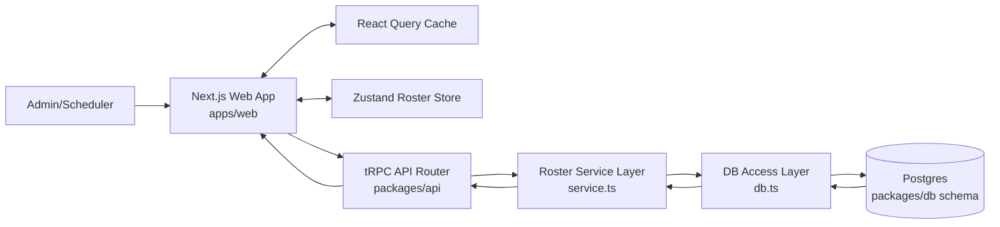

## 2) Component Architecture (Dashboard + Manage Users)

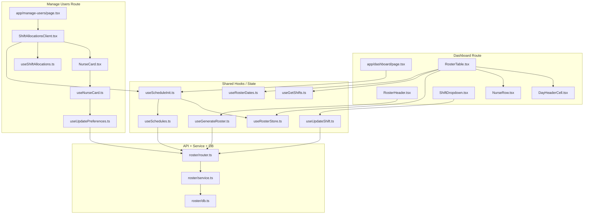

## 3) Dashboard Read Flow (Month Load -> Roster Render)

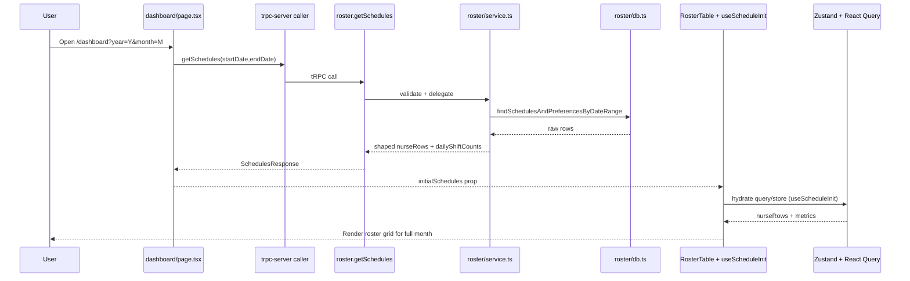

## 4) Generate Roster Flow

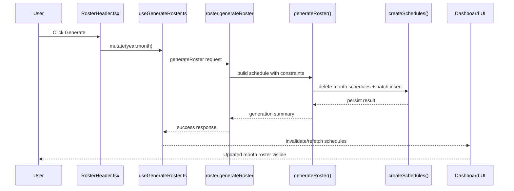

## 5) Manual Shift Update Flow (Cell Edit)

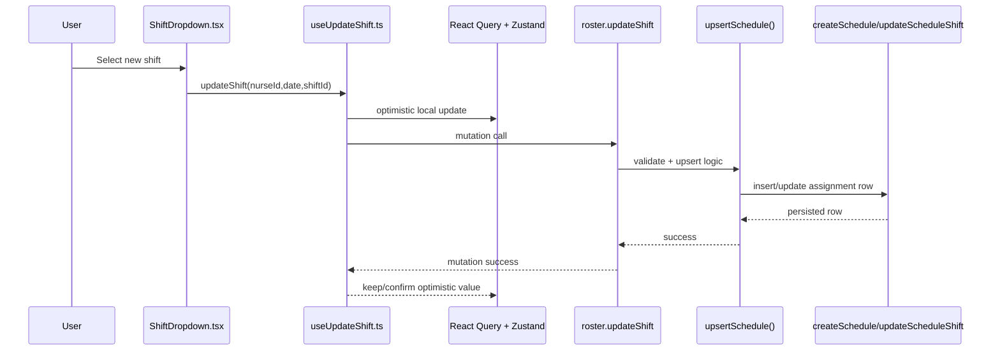

## 6) Manage Users Preference Update Flow

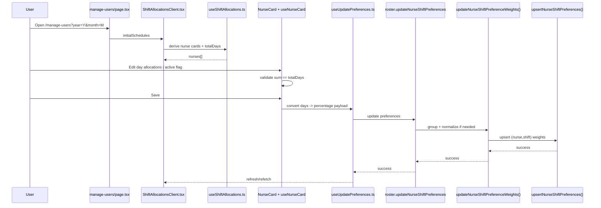

## 7) Month Change and 31-Day Synchronization Flow

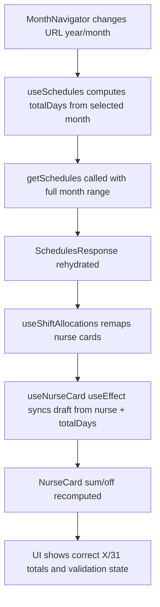

## 8) State Ownership Diagram

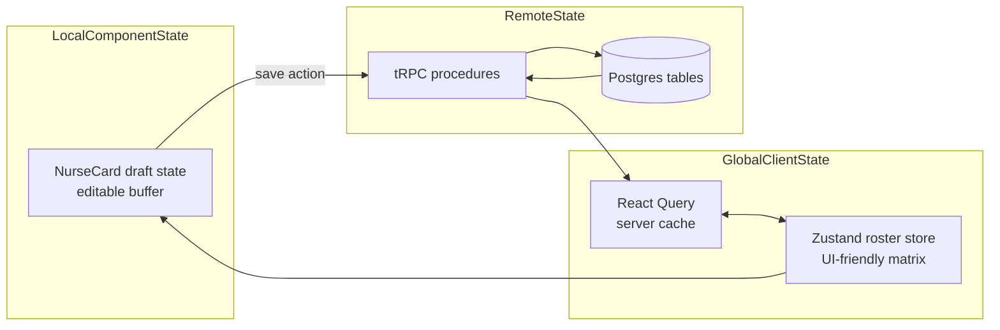

## 9) Data Contract Transformation Diagram

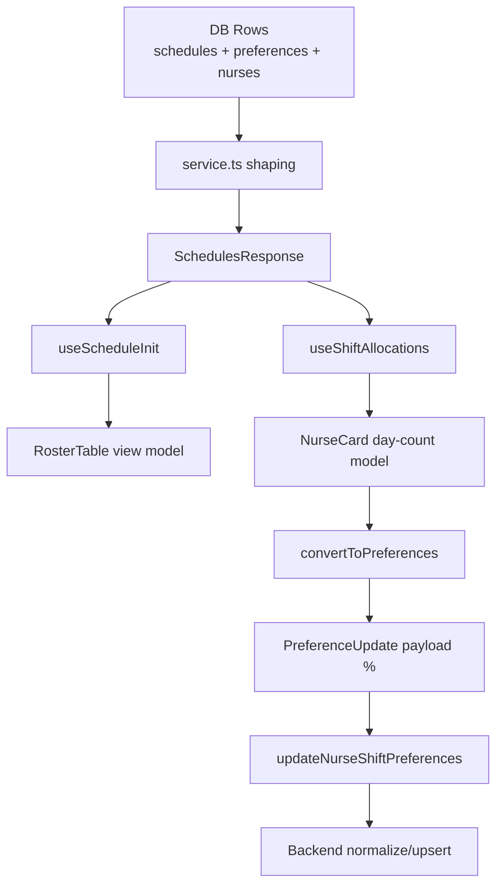

## 10) Failure and Recovery Paths

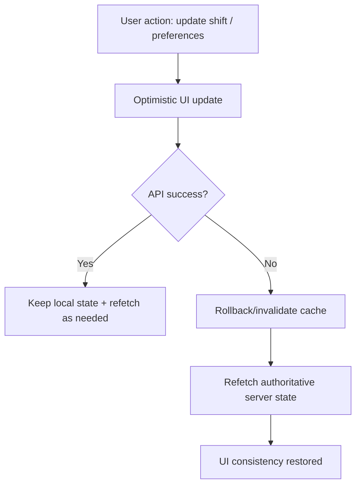

## 11) Diagram Reading Notes

- Dashboard and manage-users both consume the same schedules backend response.
- Manual shift edits and preference updates are separate mutation pipelines.
- Month boundaries and `totalDays` influence both display columns and card validation.
- `useNurseCard` draft sync on month change is critical to prevent stale totals (for example `30/31` mismatch).

## 12) Feature-Wise Data Flow (Step by Step)

This section is organized by feature in the exact execution order: initial API call -> cache/store -> UI render -> optimistic updates -> count recomputation.

### 12.1 Feature: Initial Schedule Load

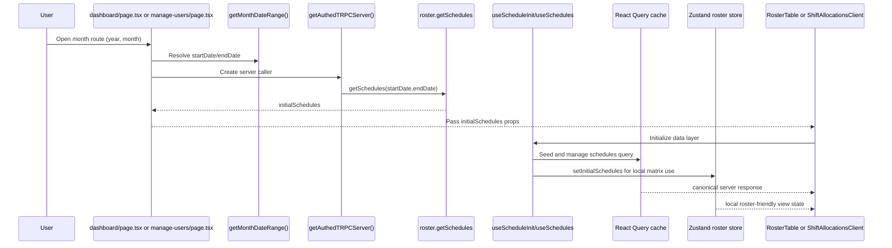

What this means in app behavior:

- Every month view starts from a server call scoped to selected month dates.
- `initialSchedules` removes first-paint blank state.
- React Query remains canonical cache; Zustand supports UI-specific fast reads/optimistic mutations.

### 12.2 Feature: Storage and Cache Ownership

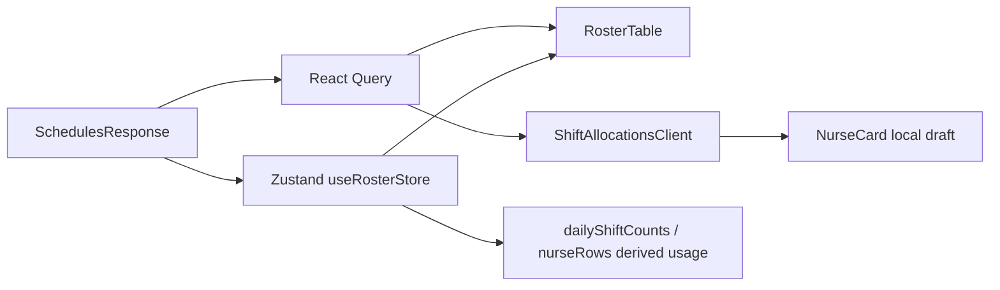

Ownership rules:

- **React Query:** source of truth for fetched server data lifecycle.
- **Zustand:** performant mutable matrix state for roster interactions.
- **NurseCard local state:** edit buffer only; must re-sync from props on month/data change.

### 12.3 Feature: Optimistic Update (Dashboard Shift Cell)

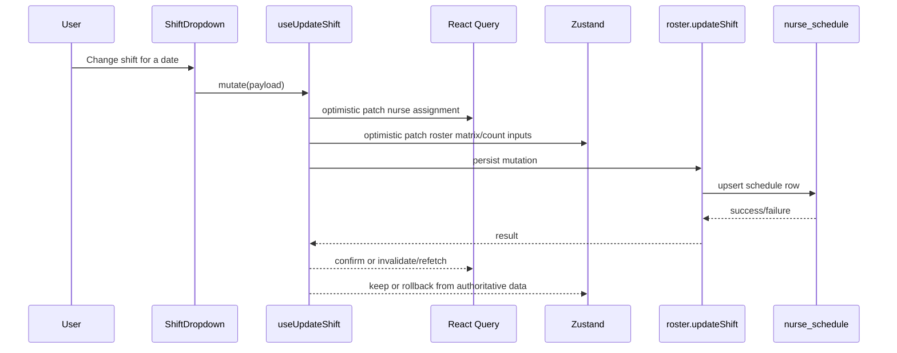

How optimistic updates work here:

- User sees immediate cell update before API roundtrip.
- If API succeeds, optimistic value is retained.
- If API fails, app refetches/invalidates to restore server truth.

### 12.4 Feature: How Counts Update on Dashboard

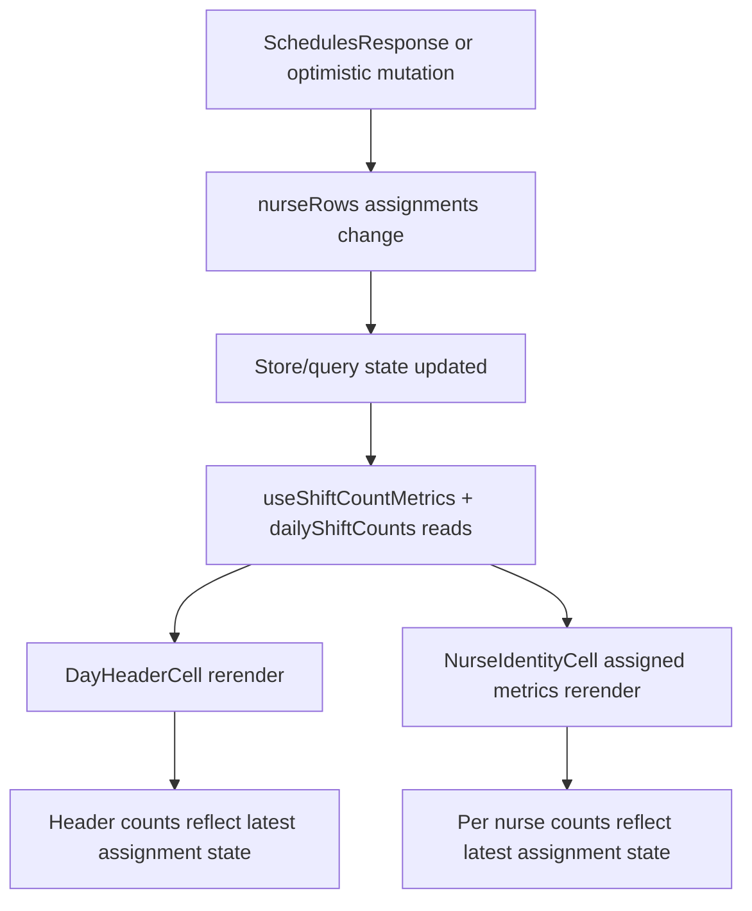

Count update behavior:

- Day-level counts are driven by assignment state keyed by date.
- Nurse-level assigned metrics update from changed assignment map.
- Header and row count UI both rerender from same updated state graph.

### 12.5 Feature: Manage Users Shift Count Model

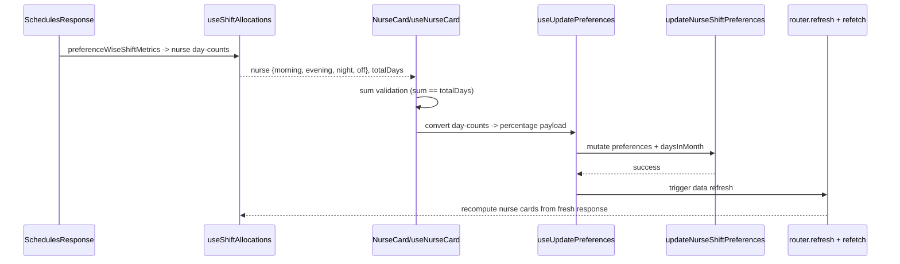

How shift counts work in manage-users:

- Manage-users cards are based on **preference-wise** metrics, not per-day assigned schedule cells.
- `off` is derived from `totalDays - (morning + evening + night)`.
- Validation is strict per selected month, so 31-day months require sums of 31.
- On month switch, `useNurseCard` must re-sync draft to avoid stale totals.

### 12.6 Feature: Month Change End-to-End (Why 30/31 Happens)

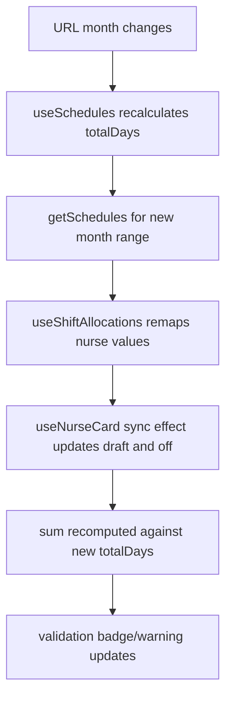

Critical implementation notes:

- If any layer still uses stale month length, cards show mismatch like `30/31`.
- Correct behavior requires both:
  - Correct month-end API range (includes day 31)
  - Draft state sync when `totalDays` changes
